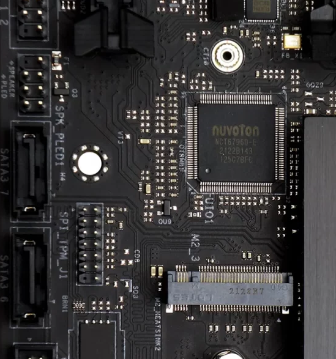

# asrock_z690_extreme
[Lm-sensors](https://github.com/lm-sensors/lm-sensors) configuration for [ASRock Z690 Extreme](https://www.asrock.com/mb/Intel/Z690%20Extreme/index.asp) and [ASRock Z690 Extreme WiFi 6E](https://www.asrock.com/mb/Intel/Z690%20Extreme%20WiFi%206E/) motherboards on Linux. 

**Warning:** this configuration is hardware dependent, it can work properly only on this motherboard! You have to modify the configuration file if you want to use it on a different hardware.

Updates:
- [June 10, 2022]: The configuration file has been forwarded to [lm-sensors project](https://github.com/lm-sensors/lm-sensors)
- [October 24, 2022]: In the queue, waiting for merge

## The motherboard
ASRock used **Nuvoton NCT6796D-E** super I/O chip (SIO) on Z690 Extreme motherboards to control multiple fans, temperature sensors and voltage lines.

Read more details about the motherboard in the [review of pcinq.com](https://www.pcinq.com/asrock-z690-extreme-wifi-6e-tested/).

## lm-sensors
The `sensors-detect` command in the `lm-sensors` package can identify the SIO chip slighly differently:

    Some Super I/O chips contain embedded sensors. We have to write to
    standard I/O ports to probe them. This is usually safe.
    Do you want to scan for Super I/O sensors? (YES/no):
    Probing for Super-I/O at 0x2e/0x2f
    Trying family `National Semiconductor/ITE'... No
    Trying family `SMSC'... No
    Trying family `VIA/Winbond/Nuvoton/Fintek'... Yes
    Found `Nuvoton NCT6798D Super IO Sensors' Success!
        (address 0x2a0, driver `nct6775')
    Probing for Super-I/O at 0x4e/0x4f
    Trying family `National Semiconductor/ITE'... Yes
    Found unknown chip with ID 0x0101

and the `sensors` command is able to report the status (if the kernel module `nct6775` is loaded):

    nct6798-isa-0290
    Adapter: ISA adapter
    in0: 704.00 mV (min = +0.00 V, max = +1.74 V)
    in1: 1.68 V (min = +0.00 V, max = +0.00 V) ALARM
    in2: 3.41 V (min = +0.00 V, max = +0.00 V) ALARM
    in3: 3.31 V (min = +0.00 V, max = +0.00 V) ALARM
    in4: 984.00 mV (min = +0.00 V, max = +0.00 V) ALARM
    in5: 888.00 mV (min = +0.00 V, max = +0.00 V) ALARM
    in6: 1.34 V (min = +0.00 V, max = +0.00 V) ALARM
    in7: 3.41 V (min = +0.00 V, max = +0.00 V) ALARM
    in8: 3.23 V (min = +0.00 V, max = +0.00 V) ALARM
    in9: 528.00 mV (min = +0.00 V, max = +0.00 V) ALARM
    in10: 528.00 mV (min = +0.00 V, max = +0.00 V) ALARM
    in11: 416.00 mV (min = +0.00 V, max = +0.00 V) ALARM
    in12: 1.01 V (min = +0.00 V, max = +0.00 V) ALARM
    in13: 616.00 mV (min = +0.00 V, max = +0.00 V) ALARM
    in14: 1.50 V (min = +0.00 V, max = +0.00 V) ALARM
    fan1: 719 RPM (min = 0 RPM)
    fan2: 835 RPM (min = 0 RPM)
    fan3: 831 RPM (min = 0 RPM)
    fan4: 660 RPM (min = 0 RPM)
    fan5: 460 RPM (min = 0 RPM)
    fan6: 681 RPM (min = 0 RPM)
    fan7: 1191 RPM (min = 0 RPM)
    SYSTIN: +35.5°C sensor = thermistor
    CPUTIN: +25.0°C (high = +127.0°C, hyst = +110.0°C) sensor = thermistor
    AUXTIN0: +9.0°C sensor = thermistor
    AUXTIN1: +23.0°C sensor = thermistor
    AUXTIN2: +35.0°C sensor = thermistor
    AUXTIN3: -1.0°C sensor = thermistor
    PECI Agent 0: +32.5°C (high = +80.0°C, hyst = +75.0°C)
					      (crit = +115.0°C)
    PCH_CHIP_CPU_MAX_TEMP: +0.0°C
    PCH_CHIP_TEMP: +0.0°C
    PCH_CPU_TEMP: +0.0°C
    intrusion0: ALARM
    intrusion1: ALARM
    beep_enable: disabled

## How to identify `lm-sensors` entities?

This is the hardest part since motherboard and SIO chip vendors are not always providing documentation about their implementation details.
I followed the same method that I used in my [previous project](https://github.com/petersulyok/asrock_z390_taichi).

 - [Nuvoton NCT677xF Data Sheet](https://media.digikey.com/pdf/data%20sheets/nuvoton%20pdfs/nct6776f,d.pdf)
 - `Z690EXTREME.xml` file of [ASRock Motherboard Utility](https://www.asrock.com/mb/Intel/Z690%20Extreme/index.asp#Download) (former name was A-Tuning). The file is located at `C:\Program Files (x86)\ASRock Utility\A-Tuning\Conf\Z690EXTREME.xml`.

### 1. voltages
Mapping and naming of the different voltage lines can be identified with the help of A-Tuning's configuration file. If you run this utility then the minimum and maximum voltage values will also be displayed.

|Motherboard | lm-sensor | Register | ASRock utility | Min | Max |
|--|--|--|--|--|--|
| CPU Vcore | in0 | 0x80 | SIO8_V | 0.9 | 2.1 |
| +5.0V | in1 | 0x81 | P5P0_V | 4.5 | 5.5 |
| ignored | in2 | 0x82 | none | | |
| +3.3V | in3 | 0x83 | P3P3_V | 2.98 | 3.63 |
| +12V | in4 | 0x84 | P12_V | 2.98 | 3.63 |
| VCCIN_AUX | in5 | 0x85 | SIO1_V | 1.7 | 2.5 |
| DRAM | in6 | 0x86 | SIO3_V | 1.1 | 1.65 |
| ignored | in7 | 0x87 | | | |
| ignored | in8 | 0x88 | | | |
| ignored | in9 | 0x89 | | | |
| +1.05V PROC | in10 | 0x8A | SIO6_V | 0.95 | 1.8 |
| +0.82V PCH | in11 | 0x8B | SIO4_V | 0.72 | 1.3 |
| +1.05V PCH | in12 | 0x8C | SIO2_V | 0.94 | 1.5 |
| VCCSA | in13 | 0x8D | SIO5_V | 0.95 | 2.0 |

### 2. fans
These assignments can be checked either with turning the fans on and off manually or adjusting their rotation speed in the BIOS individually. The reported fan values do not require additional computational steps in the configuration file.

|Motherboard | lm-sensor |
|--|--|
| Chassis Fan3 | fan1 |
| CPU Fan1 | fan2 |
| CPU Fan2 | fan3 |
| Chassis Fan1 | fan4 |
| Chassis Fan2 | fan5 |
| Chassis Fan4 | fan6 |
| Chassis Fan5 | fan7 |

### 3. temperatures
|Motherboard | lm-sensor |
|--|--|
| Motherboard | temp1 (SYSTIN) |
| CPU | temp7 (PECI Agent 0) |
  
Please note:
 - `CPUTIN` is a sensor on the motherboard showing the temperature around the CPU socket. It will always be lower than the real CPU temperature
 - `PECI Agent 0` was selected to represent the CPU temperature
 - Use `coretemp` kernel module if you need temperatures of the individual CPU cores
 - There are no useful information about the other sensors, they are ignored

## The new configuration
You can copy this new configuration file (`Z690_Extreme.conf`) to folder `/etc/sensors.d/`, restart the `lm_sensors.service`, and the output of the `sensors` command will display this:

    
    nct6798-isa-02a0
    Adapter: ISA adapter
    CPU Vcore:    496.00 mV (min =  +0.20 V, max =  +2.04 V)
    +5.0V:          5.04 V  (min =  +4.51 V, max =  +5.50 V)
    +3.3V:          3.33 V  (min =  +2.98 V, max =  +3.63 V)
    +12V:          11.81 V  (min = +11.42 V, max = +12.58 V)
    VCCIN_AUX:      1.78 V  (min =  +1.70 V, max =  +2.50 V)
    DRAM:           1.34 V  (min =  +1.10 V, max =  +1.65 V)
    +1.05V PROC:    1.06 V  (min =  +0.94 V, max =  +1.81 V)
    +0.82V PCH:   832.00 mV (min =  +0.72 V, max =  +1.30 V)
    +1.05V PCH:     1.01 V  (min =  +0.95 V, max =  +1.50 V)
    VCCSA:          1.23 V  (min =  +0.94 V, max =  +2.00 V)
    Chassis fan3:  581 RPM  (min =    0 RPM)
    CPU fan1:      773 RPM  (min =  200 RPM)
    CPU fan2:      716 RPM  (min =    0 RPM)
    Chassis fan1:  869 RPM  (min =    0 RPM)
    Chassis fan2:  503 RPM  (min =    0 RPM)
    Chassis fan4:  563 RPM  (min =    0 RPM)
    Chassis fan5: 2523 RPM  (min =    0 RPM)
    Motherboard:   +30.5°C    sensor = thermistor
    CPU:           +29.5°C  (high = +80.0°C, hyst = +75.0°C)
			(crit = +115.0°C)
    beep_enable:  enabled

Notes:
- Beep warnings are enabled.
- There is a limitation how sensors can handle voltage values above 2.048V (read more about this topic on page 59 in [NCT677xF Data Sheet](https://media.digikey.com/pdf/data%20sheets/nuvoton%20pdfs/nct6776f,d.pdf)). I assume this is the reason why some maximum values are truncated at 2.04V in `lm-sensors`.
- All fans are enabled in the configuration. You can use `ignore` statement to hide any of them.
- If you modify min or max values in the configuration you have to restart the systemd service of `lm-sensors` (e.g. `systemctl restart lm_sensors.service`).
- This configuration was tested on Debian Linux 11 (kernel v5.17) and Arch Linux (kernel v5.15).

## References
- [My previous ASRock Z390 Taichi github project](https://github.com/petersulyok/asrock_z390_taichi)
- [aaronsb's github project](https://gist.github.com/aaronsb/347d62b63456ae131916c3affd212c05)
- [lm-sensors's github project](https://github.com/lm-sensors/lm-sensors)
- [nct6775 kernel module](https://www.kernel.org/doc/html/v5.12/hwmon/nct6775.html)
- [Nuvoton NCT677xF Data sheet](https://media.digikey.com/pdf/data%20sheets/nuvoton%20pdfs/nct6776f,d.pdf)
- [www.pcinq.com site's review](https://www.pcinq.com/reviews/motherboards-reviews/asrock-z690-extreme-wifi-6e-tested/)
- [Improving Nuvoton NCT6776 lm_sensors output](https://blog.hqcodeshop.fi/archives/276-Improving-Nuvoton-NCT6776-lm_sensors-output.html)

> Written with [StackEdit](https://stackedit.io/).

